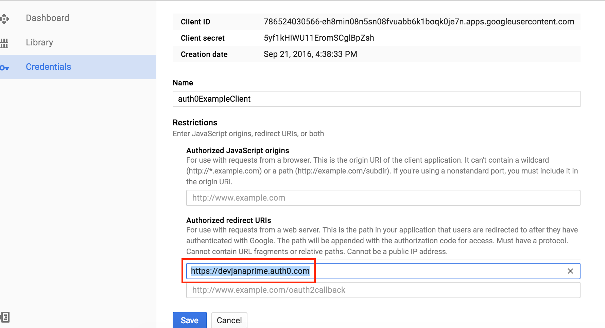
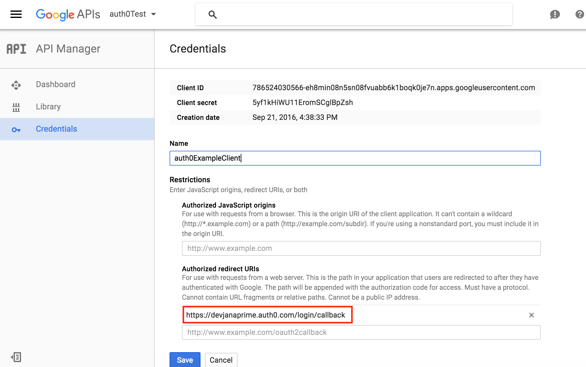

Auth0 Example
=============

In this example project we'll user Auth0 to allow user to log in to our site via a Google account. This requires some setup with an Auth0 account, a Google developer account, and our page itself.

Needed Accounts
--------------
First, create an account with Auth0 an a google developer account:

* https://auth0.com/
* https://console.developers.google.com/

Account Setup
=============

Initial Google setup
--------------------

Auth0 setup
-----------

Connecting Auth0 to Google
--------------------------

Setting up our project
======================
